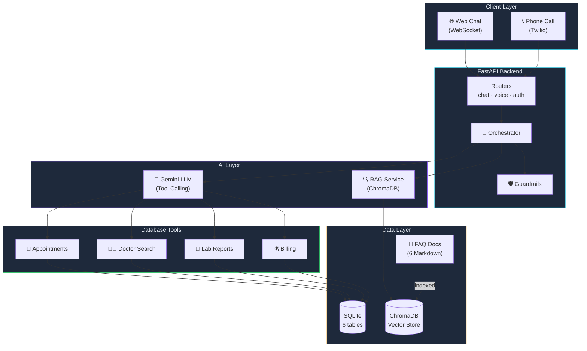
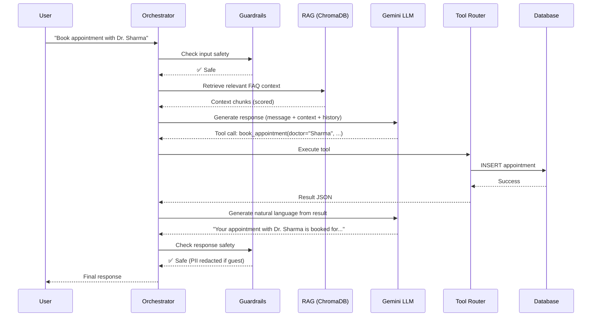
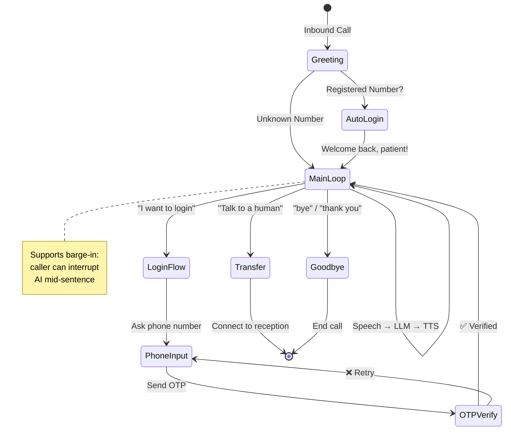
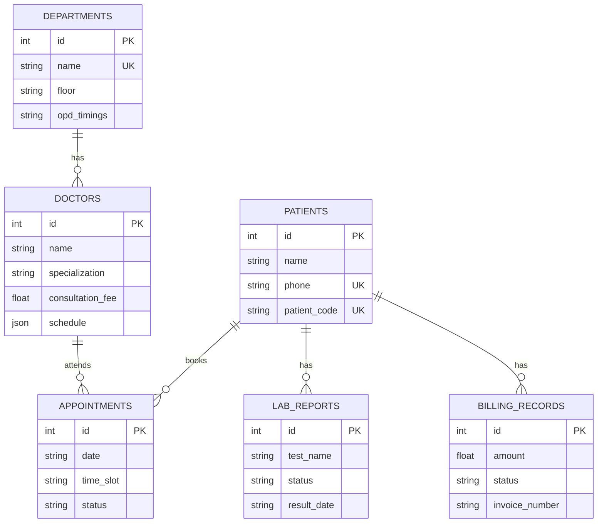

<div align="center">

# 🏥 City General Hospital — AI Voice & Chat Assistant

**A full-stack AI hospital receptionist that handles phone calls and web chat,**  
**powered by Google Gemini, RAG retrieval, and real-time tool calling.**

[](https://python.org)
[](https://fastapi.tiangolo.com)
[](https://ai.google.dev)
[](https://twilio.com)
[](https://docker.com)

---

*Patients can call the hospital phone number or use the web chat to ask questions,*  
*book appointments, check lab reports, and manage billing — all through natural conversation.*

</div>

---

## ✨ Key Features

<table>
<tr>
<td width="50%">

### 💬 Web Chat Interface
- Premium dark glassmorphism UI
- WebSocket real-time messaging
- Quick action chips for common queries
- Typing indicators & micro-animations
- Voice input via browser mic (Web Speech API)

</td>
<td width="50%">

### 📞 Twilio Voice Integration
- Inbound phone call handling
- Speech-to-Text ↔ Text-to-Speech loop
- DTMF keypad support for OTP entry
- Auto-login for registered callers
- Barge-in support (interrupt AI mid-speech)

</td>
</tr>
<tr>
<td>

### 🧠 AI & RAG Pipeline
- **RAG-Grounded** answers from 6 FAQ documents
- **LLM Tool Calling** — Gemini intelligently triggers database operations
- **Conversation Memory** — last 5 exchanges maintained per session
- **Safety Guardrails** — prompt injection detection & medical advice refusal

</td>
<td>

### 🔐 Authentication & Access Control
- **Guest mode** → public FAQs only
- **Registered patient** → personalized services
- OTP-based phone verification
- Session management with auto-expiry
- PII redaction for guest responses

</td>
</tr>
</table>

---

## 🏗️ Architecture



### Request Flow



---

## 🛠️ Tool Calling System

The LLM dynamically decides when to call database tools based on conversation context:

| Tool | Function | Auth Required | Example Query |
|------|----------|:---:|---------------|
| `book_appointment` | Book with a doctor by name, date, time | ✅ | *"Book with Dr. Sharma tomorrow at 10 AM"* |
| `cancel_appointment` | Cancel by appointment ID | ✅ | *"Cancel appointment #3"* |
| `list_appointments` | Show all patient appointments | ✅ | *"Show my upcoming appointments"* |
| `search_doctors` | Find doctors by dept/name/specialization | ❌ | *"Who are the cardiologists?"* |
| `get_department_info` | Department details, floor, timings | ❌ | *"Tell me about the ENT department"* |
| `check_report_status` | Lab report status & results | ✅ | *"Is my blood test ready?"* |
| `get_billing_summary` | Billing records & outstanding balance | ✅ | *"What's my billing summary?"* |

---

## 📞 Voice Call Flow



---

## 🗄️ Database Schema



---

## 🚀 Quick Start

### Option 1: Docker (Recommended)

```bash
# Clone the repo
git clone https://github.com/space-debris/hospital-voice-bot.git
cd hospital-voice-bot

# Create your .env file
cp .env.example .env
# Edit .env and add your GEMINI_API_KEY

# Build and run
docker compose up --build
```

> **Note:** On first run, you'll need to download the ChromaDB ONNX model (~79MB).  
> Run this once before building:
> ```bash
> pip install chromadb
> python -c "from chromadb.utils.embedding_functions import ONNXMiniLM_L6_V2; ONNXMiniLM_L6_V2()"
> ```
> Then copy the model cache:
> ```bash
> # Windows
> xcopy "%USERPROFILE%\.cache\chroma\onnx_models" "onnx_models\" /E /I /Y
> # Linux/Mac
> cp -r ~/.cache/chroma/onnx_models ./onnx_models
> ```

### Option 2: Local Development

```bash
# Create virtual environment
python -m venv venv
venv\Scripts\activate       # Windows
# source venv/bin/activate  # Mac/Linux

# Install dependencies
pip install -r requirements.txt

# Create .env file
cp .env.example .env
# Edit .env and add your GEMINI_API_KEY

# Run the server
uvicorn app.main:app --reload --port 8000
```

### Open the app

Navigate to **http://localhost:8000** in your browser.

---

## 🔑 Environment Variables

| Variable | Required | Description |
|----------|:---:|-------------|
| `GEMINI_API_KEY` | ✅ | Google Gemini API key ([get one free](https://aistudio.google.com/app/apikey)) |
| `TWILIO_ACCOUNT_SID` | ❌ | Twilio account SID (for voice calls) |
| `TWILIO_AUTH_TOKEN` | ❌ | Twilio auth token |
| `TWILIO_PHONE_NUMBER` | ❌ | Your Twilio phone number |
| `NGROK_URL` | ❌ | Public URL for Twilio webhooks |

> Voice calling features require a Twilio account and ngrok. The web chat works with just the Gemini API key.

---

## 🧪 Test Accounts

The database is seeded with mock patients on startup:

| Patient | Phone | Patient Code |
|---------|-------|------|
| Amit Kumar | `9876543210` | CGH-10001 |
| Sneha Verma | `9876543211` | CGH-10002 |
| Ravi Shankar | `9876543212` | CGH-10003 |
| Deepa Nair | `9876543213` | CGH-10004 |
| Mahesh Choudhary | `9876543214` | CGH-10005 |

> **OTPs are printed to the server console.** Check your terminal after clicking "Send OTP".

---

## 💬 Sample Conversations

**Guest (no login):**
```
You: What are your OPD timings?
Bot: Our OPD operates Monday to Saturday, 9:00 AM to 6:00 PM...

You: Which departments do you have?
Bot: City General Hospital has 8 departments: Cardiology, Orthopedics...
```

**Registered Patient (after login):**
```
You: Book an appointment with Dr. Sharma tomorrow at 10 AM
Bot: ✅ Your appointment with Dr. Priya Sharma (Cardiology) is booked
     for 2026-02-26 at 10:00 AM. Consultation fee: ₹800.

You: Check my lab report status
Bot: You have 3 lab reports:
     • Complete Blood Count — ✅ Ready (Feb 20)
     • Lipid Profile — ⏳ Processing
     • Thyroid Panel — ⏳ Pending
```

---

## 🗂️ Project Structure

```
hospital-voice-bot/
├── app/
│   ├── main.py              # FastAPI app + lifespan events
│   ├── config.py            # Pydantic settings from .env
│   ├── database.py          # SQLite + SQLAlchemy engine
│   ├── models.py            # 6 database tables
│   ├── schemas.py           # Pydantic request/response schemas
│   ├── guardrails.py        # Input safety + PII redaction
│   ├── logger.py            # Structured logging
│   ├── routers/
│   │   ├── chat.py          # REST + WebSocket chat endpoints
│   │   ├── auth.py          # OTP login/verify endpoints
│   │   └── voice.py         # Twilio voice webhooks (548 lines)
│   ├── services/
│   │   ├── orchestrator.py  # Central conversation pipeline
│   │   ├── llm_service.py   # Gemini LLM + tool calling
│   │   ├── rag_service.py   # ChromaDB vector search
│   │   ├── auth_service.py  # OTP generation & verification
│   │   ├── session_store.py # In-memory session management
│   │   ├── tool_router.py   # Tool dispatch + auth gate
│   │   ├── voice_session.py # Twilio call state machine
│   │   ├── metrics.py       # App metrics (latency, counts)
│   │   └── audit.py         # Audit logging to DB
│   ├── tools/
│   │   ├── appointment.py   # Book / cancel / list
│   │   ├── doctor_schedule.py # Search doctors & departments
│   │   ├── reports.py       # Lab report status
│   │   └── billing.py       # Billing summary
│   └── data/
│       ├── seed.py          # Mock hospital data generator
│       └── faqs/            # 6 FAQ markdown documents
├── frontend/
│   ├── index.html           # Chat UI
│   ├── styles.css           # Dark glassmorphism theme
│   └── app.js               # WebSocket + voice input logic
├── Dockerfile               # Container build recipe
├── docker-compose.yml       # One-command deployment
├── requirements.txt         # Python dependencies
└── .env.example             # Environment variable template
```

---

## 🔧 Tech Stack

| Layer | Technology | Purpose |
|-------|-----------|---------|
| **Backend** | FastAPI + Uvicorn | Async API server with WebSocket support |
| **LLM** | Google Gemini | Natural language understanding + tool calling |
| **RAG** | ChromaDB + MiniLM-L6-v2 | Semantic search over hospital FAQ documents |
| **Database** | SQLite + SQLAlchemy | Patient, doctor, appointment, billing data |
| **Voice** | Twilio Programmable Voice | Inbound call handling, ASR, TTS |
| **Frontend** | Vanilla HTML/CSS/JS | Dark-themed chat UI with WebSocket |
| **Containerization** | Docker + Compose | One-command deployment |

---

## 🛡️ Safety Features

- **Prompt injection detection** — catches "ignore instructions" attacks
- **Medical advice refusal** — declines diagnosis/prescription requests with doctor referral
- **PII redaction** — masks patient codes and phone numbers for guest users
- **Input validation** — message length limits, OTP attempt throttling
- **Twilio request validation** — middleware verifies webhook signatures
- **Rate limiting** — configurable per-endpoint rate limits

---

## 📈 Monitoring

The app exposes built-in metrics at `/metrics`:

```json
{
  "messages_processed": 142,
  "tool_calls_total": 38,
  "rag_latency_ms": 12.5,
  "llm_latency_ms": 890.3,
  "active_sessions": 4
}
```

Health check available at `/health`.

---

<div align="center">

**Built as a learning project demonstrating RAG + Tool Calling + Voice AI + FastAPI architecture.**

⭐ Star this repo if you found it useful!

</div>
